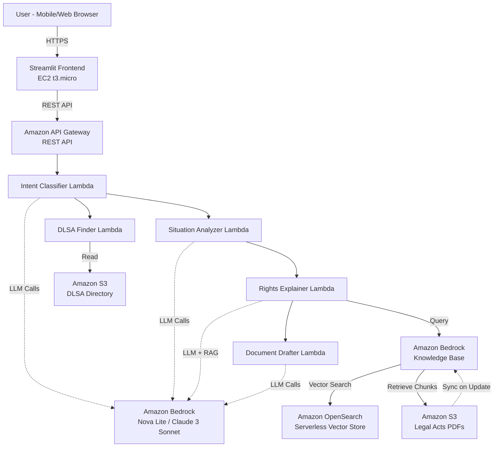

# Design Document: Nyaya Saathi

## Overview

Nyaya Saathi ("Justice Companion") is an AI-powered legal assistance platform that helps marginalized communities in India understand their legal rights and draft grievance documents. The system uses a serverless AWS architecture with Amazon Bedrock for AI capabilities, implementing a RAG (Retrieval-Augmented Generation) pipeline over 15+ Indian legal acts to provide accurate, contextual legal guidance in Hindi and English.

The platform follows a three-stage prompt chaining workflow: (1) Situation Analyzer classifies intent and extracts key facts, (2) Rights Explainer uses RAG to match situations to legal provisions and generates plain-language explanations, and (3) Document Drafter creates formatted grievance documents. All processing happens in temporary sessions without storing PII, ensuring user privacy.

---

## Architecture

### High-Level Architecture



### Architecture Rationale

- **Serverless-first:** Using Lambda + API Gateway means zero infrastructure management, automatic scaling, and pay-per-use pricing — ideal for a hackathon prototype and future scaling to millions of users across India.
- **Managed AI services:** Amazon Bedrock provides access to frontier LLMs without needing to host models, manage GPUs, or handle model versioning.
- **RAG over fine-tuning:** We use Retrieval-Augmented Generation instead of fine-tuning because: (a) legal acts change — RAG allows instant updates by replacing S3 documents, (b) RAG provides source attribution (cite the exact Act & Section), (c) it's dramatically cheaper and faster to implement.
- **Microservices Lambda pattern:** 5 dedicated Lambda functions (Intent Classifier, Situation Analyzer, Rights Explainer, Document Drafter, DLSA Finder) instead of a single monolith — enables independent scaling, cleaner testing, and modular prompt management.

### Component Responsibilities

**Frontend Layer (Streamlit on EC2)**
- Mobile-responsive web interface with text and voice input
- Session state management (temporary, in-memory)
- Hindi/English UI with voice recording widget
- Display formatted responses with source citations
- Lightweight design (<500 KB page load)

**API Layer (Amazon API Gateway)**
- RESTful endpoints for all operations
- Request validation and rate limiting
- HTTPS enforcement
- CORS configuration for web access

**Compute Layer (AWS Lambda Functions)**
- Intent Classifier: Routes requests to appropriate workflow
- Situation Analyzer: Extracts facts and context from user input
- Rights Explainer: Performs RAG retrieval and generates explanations
- Document Drafter: Creates formatted legal documents
- DLSA Finder: Searches legal aid directory by location

**AI Layer (Amazon Bedrock)**
- LLM: Amazon Nova Lite (cost-effective, strong Hindi) or Claude 3 Sonnet (higher accuracy fallback)
- Knowledge Base: Managed RAG service with automatic chunking and indexing
- Embeddings: Amazon Titan Embeddings V2 for semantic search

**Storage Layer**
- S3 Legal Corpus: 15+ Indian legal act PDFs (IPC/BNS, CrPC/BNSS, Domestic Violence Act, SC/ST Act, RTI, MGNREGA, Consumer Protection, POCSO, labour laws)
- S3 DLSA Directory: JSON file with district-wise legal aid center information
- OpenSearch Serverless: Vector embeddings for semantic search

### Data Flow

1. User submits situation in Hindi/English via Streamlit
2. Streamlit sends request to API Gateway with session ID
3. Intent Classifier Lambda determines request type (new_situation, follow_up, document_request, legal_aid_search, out_of_scope)
4. For new_situation:
   - Situation Analyzer extracts key facts (parties, location, issue type, timeline)
   - Rights Explainer queries Knowledge Base with semantic search
   - Knowledge Base returns relevant legal chunks with source attribution
   - Rights Explainer generates plain-language explanation in Hindi
   - Response includes Act names, section numbers, and actionable steps
5. For document_request:
   - Document Drafter uses situation context and identified rights
   - Generates formatted document (RTI, FIR, complaint, legal aid application)
   - Includes submission instructions
6. For legal_aid_search:
   - DLSA Finder queries directory by user's district/state
   - Returns nearest 3 centers with contact details
7. Response flows back through API Gateway to Streamlit
8. Streamlit displays formatted response with disclaimer

---

## Components and Interfaces

### 1. Streamlit Frontend

**Purpose**: Provide mobile-responsive web interface for user interaction

**Key Components**:
- `app.py`: Main Streamlit application entry point
- `ui_components.py`: Reusable UI widgets (input box, voice recorder, response display)
- `session_manager.py`: Temporary session state management
- `api_client.py`: HTTP client for backend API calls

**Key UI Elements:**

| Element | Description |
|---------|-------------|
| Chat Input | Text input box at the bottom (WhatsApp-style) for natural language input |
| Message Bubbles | User messages (right-aligned, blue) and AI responses (left-aligned, white) |
| Rights Cards | Expandable cards showing: Right name → Simple explanation → Act & Section → Action steps |
| Document Panel | Side panel or modal showing generated legal document with Copy/Download buttons |
| Disclaimer Banner | Fixed top banner: "यह मार्गदर्शन है, कानूनी सलाह नहीं" / "This is guidance, not legal advice" |
| Language Toggle | Hindi/English switch in top-right corner |
| Legal Aid Finder | Button to search nearest DLSA by state/district dropdown |

**Design Decisions:**
- **Streamlit over React:** Chosen for speed of development (Python-only, no separate frontend build) and beginner-friendliness. For production, would migrate to Next.js/React.
- **Chat-style interface:** Familiar pattern for users (WhatsApp-like), lowers learning curve to zero.
- **Mobile-first:** CSS media queries ensure usability on 5-inch screens with touch input.

**Interface**:
```python
# Session state structure (in-memory only)
{
    "session_id": str,  # UUID for this conversation
    "conversation_history": List[Dict],  # [{role, content, timestamp}]
    "current_situation": Dict,  # Extracted facts from Situation Analyzer
    "identified_rights": List[Dict],  # Rights from Rights Explainer
    "language": str  # "hi" or "en"
}

# API request format
{
    "session_id": str,
    "user_input": str,
    "language": str,
    "intent_override": Optional[str]  # For explicit document requests
}

# API response format
{
    "response_text": str,  # Formatted response in user's language
    "intent": str,  # Detected intent
    "sources": List[Dict],  # [{act_name, section, relevance_score}]
    "suggested_actions": List[str],  # Next steps
    "generated_document": Optional[str],  # If document was generated
    "dlsa_centers": Optional[List[Dict]],  # If legal aid search
    "confidence": float,  # 0-1 confidence score
    "disclaimer": str  # Always present
}
```

**Voice Input Handling**:
- Use `streamlit-audio-recorder` or `st.audio_input` for voice capture
- Send audio to AWS Transcribe or use browser's Web Speech API for Hindi transcription
- Fall back to text input if voice fails

### 2. Intent Classifier Lambda

**Purpose**: Classify user requests into workflow categories

**Input**:
```python
{
    "session_id": str,
    "user_input": str,
    "conversation_history": List[Dict],
    "language": str
}
```

**Output**:
```python
{
    "intent": str,  # new_situation | follow_up | document_request | legal_aid_search | out_of_scope
    "confidence": float,
    "extracted_entities": Dict,  # {document_type, location, etc.}
    "clarification_needed": bool
}
```

**Logic**:
- Use Amazon Bedrock LLM with few-shot prompting
- Prompt template includes examples of each intent type
- Extract entities (document type, location) using structured output
- If confidence < 0.7, set clarification_needed = true

**Intent Classification Table:**

| Intent | Trigger Examples | Action |
|--------|-----------------|--------|
| `new_situation` | "My husband beats me" / "Mera maalik paisa nahi de raha" | Full RAG pipeline |
| `follow_up` | "What if he threatens me?" / "Aur kya kar sakti hoon?" | Context-aware follow-up |
| `document_request` | "RTI likho" / "Draft a complaint" | Document generation |
| `legal_aid_search` | "Nearest legal aid" / "Free vakil kahan milega?" | DLSA directory lookup |
| `out_of_scope` | "What's the weather?" / "How to make a bomb?" | Polite refusal |

**Prompt Template**:
```
You are an intent classifier for a legal assistance system. Classify the user's 
request into one of these categories:
- new_situation: User describes a legal problem for the first time
- follow_up: User asks follow-up questions about previous response
- document_request: User explicitly asks for document generation (RTI, FIR, 
  complaint, legal aid application)
- legal_aid_search: User asks for legal aid center information
- out_of_scope: Request is outside legal assistance (personal advice, medical, 
  financial)

Examples:
[Few-shot examples for each intent type]

User input: {user_input}
Conversation history: {conversation_history}

Respond with JSON: {"intent": "...", "confidence": 0.0-1.0, "entities": {...}}
```

### 3. Situation Analyzer Lambda

**Purpose**: Extract structured facts from user's situation description

**Input**:
```python
{
    "session_id": str,
    "user_input": str,
    "language": str
}
```

**Output**:
```python
{
    "situation_summary": str,  # Concise summary in English for RAG query
    "extracted_facts": {
        "parties_involved": List[str],  # ["user", "employer", "police", etc.]
        "location": Optional[str],  # District/state if mentioned
        "issue_type": str,  # "domestic_violence", "wage_theft", "discrimination", etc.
        "timeline": Optional[str],  # When incident occurred
        "specific_details": Dict  # Issue-specific facts
    },
    "language": str  # Original language for response generation
}
```

**Logic**:
- Use Bedrock LLM with structured output prompting
- Extract key entities using NER-style prompting
- Normalize issue types to predefined categories
- Preserve original language for later response generation

**Prompt Template — Situation Analyzer:**
```
System: You are a legal rights analyst for India. Given a person's description 
of their situation, extract structured facts including:
- Category (domestic violence, wage theft, discrimination, consumer complaint, etc.)
- Key actors (who is involved)
- Key events (what happened)
- Location/jurisdiction clues
- Urgency level (immediate danger vs. ongoing issue vs. past event)

Respond ONLY in structured JSON format.
```

### 4. Rights Explainer Lambda

**Purpose**: Query Knowledge Base and generate plain-language rights explanation

**Input**:
```python
{
    "session_id": str,
    "situation_summary": str,
    "extracted_facts": Dict,
    "language": str
}
```

**Output**:
```python
{
    "rights_explanation": str,  # Plain-language explanation in user's language
    "applicable_rights": List[{
        "act_name": str,
        "section": str,
        "provision_text": str,  # Simplified version
        "relevance_score": float
    }],
    "actionable_steps": List[str],
    "confidence": float
}
```

**Logic**:
1. Generate semantic query from situation_summary
2. Call Bedrock Knowledge Base RetrieveAndGenerate API
3. Knowledge Base performs vector search in OpenSearch
4. Retrieve top 5-10 relevant chunks from legal PDFs
5. LLM synthesizes chunks into plain-language explanation
6. Translate to Hindi if language = "hi"
7. Add source citations in format: "(Act Name, Section X)"
8. If confidence < 0.6, add DLSA referral suggestion

**RAG Configuration**:
- Chunk size: 1000 tokens with 200 token overlap
- Top-k retrieval: 10 chunks
- Reranking: Enabled for better relevance
- Metadata filters: Can filter by act_name if needed

**Prompt Template — Rights Explainer (with RAG context):**
```
System: You are Nyaya Saathi, a legal rights guide for India. Based on the 
retrieved legal provisions and the user's situation:

1. List all applicable legal rights (max 5 most relevant)
2. For each right, provide:
   - The right in one simple sentence (Class 8 Hindi reading level)
   - The specific Act name and Section number
   - One sentence explaining what this means practically
3. Then provide step-by-step action guide (max 7 steps)

Rules:
- ALWAYS cite Act name and Section number
- Use simple Hindi or English as per user's language
- If unsure, say so — never fabricate legal provisions
- End with recommendation to consult DLSA for free legal aid

Retrieved Legal Context: {rag_results}
User Situation: {situation_analysis}
```

### 5. Document Drafter Lambda

**Purpose**: Generate formatted legal documents based on situation and rights

**Input**:
```python
{
    "session_id": str,
    "document_type": str,  # "rti" | "fir" | "complaint" | "legal_aid_application"
    "situation_summary": str,
    "extracted_facts": Dict,
    "applicable_rights": List[Dict],
    "language": str
}
```

**Output**:
```python
{
    "document_text": str,  # Formatted document in user's language
    "submission_instructions": List[str],  # Step-by-step filing guide
    "required_attachments": List[str],  # Documents user should attach
    "authority_address": Optional[str]  # Where to submit
}
```

**Logic**:
- Use document-specific prompt templates
- Include all relevant facts from extracted_facts
- Cite applicable legal sections
- Format according to official document standards
- Add submission instructions specific to document type

**Document Templates**:
- RTI Application: Standard format per RTI Act 2005
- FIR Description: Narrative format with legal sections
- Complaint Letter: Formal letter to appropriate authority
- Legal Aid Application: DLSA application form format

**Prompt Template — Document Drafter:**
```
System: Draft a {document_type} in {language} for the following situation.
Follow the standard format for {document_type} in India.

Include:
- Proper addressing (To: appropriate authority)
- Date placeholder
- Subject line
- Body with relevant facts and legal provisions
- Specific Act & Section references
- Relief/information sought
- Placeholder markers: [YOUR NAME], [YOUR ADDRESS], [DATE], [AADHAAR NUMBER]

Situation: {facts}
Applicable Laws: {identified_provisions}
```

### 6. DLSA Finder Lambda

**Purpose**: Search legal aid directory by location

**Input**:
```python
{
    "location": str,  # District or state name
    "max_results": int  # Default 3
}
```

**Output**:
```python
{
    "centers": List[{
        "name": str,
        "district": str,
        "state": str,
        "address": str,
        "phone": str,
        "email": Optional[str],
        "distance_km": Optional[float]  # If user location available
    }]
}
```

**Logic**:
- Load DLSA directory from S3 (cached in Lambda)
- Fuzzy match location to district/state names
- Return nearest centers sorted by distance
- If no match, return state-level SLSA contact

**DLSA Directory Structure** (S3 JSON):
```json
{
    "districts": [
        {
            "state": "Uttar Pradesh",
            "district": "Lucknow",
            "dlsa_name": "District Legal Services Authority, Lucknow",
            "address": "...",
            "phone": "...",
            "email": "..."
        }
    ]
}
```

---

## Knowledge Base Design

### Data Source

Indian legal acts sourced from [indiacode.nic.in](https://www.indiacode.nic.in/) (government public domain).

### S3 Bucket Structure

```
s3://nyaya-saathi-legal-corpus/
├── acts/
│   ├── ipc-bharatiya-nyaya-sanhita.pdf
│   ├── crpc-bharatiya-nagarik-suraksha-sanhita.pdf
│   ├── domestic-violence-act-2005.pdf
│   ├── dowry-prohibition-act-1961.pdf
│   ├── sc-st-atrocities-act-1989.pdf
│   ├── rti-act-2005.pdf
│   ├── mgnrega-act-2005.pdf
│   ├── consumer-protection-act-2019.pdf
│   ├── motor-vehicles-act-1988.pdf
│   ├── payment-of-wages-act-1936.pdf
│   ├── minimum-wages-act-1948.pdf
│   ├── senior-citizens-act-2007.pdf
│   ├── pocso-act-2012.pdf
│   ├── rte-act-2009.pdf
│   └── legal-services-authorities-act-1987.pdf
├── simplified-guides/
│   ├── domestic-violence-rights-hindi.md
│   ├── labor-rights-hindi.md
│   ├── rti-guide-hindi.md
│   └── free-legal-aid-guide-hindi.md
└── dlsa-directory/
    └── dlsa-all-india.json
```

### Knowledge Base Configuration

```python
class KnowledgeBaseConfig:
    s3_bucket: str  # "nyaya-saathi-legal-corpus"
    data_source_id: str  # Bedrock KB data source
    embedding_model: str  # "amazon.titan-embed-text-v2:0"
    vector_store_config: {
        "type": "opensearch_serverless",
        "collection_arn": str
    }
    chunking_strategy: {
        "type": "fixed_size",
        "max_tokens": 1000,
        "overlap_percentage": 20
    }
```

### Design Rationale

- **Acts as PDFs:** Legal acts are available as PDFs from indiacode.nic.in — direct upload with no preprocessing needed
- **Simplified guides:** Hand-curated plain-language summaries of key rights in Hindi — ensures RAG retrieval can find simple explanations, not just legal jargon
- **DLSA directory:** JSON file with all District Legal Services Authorities for the nearest-center finder feature
- **Chunk size (1000 tokens, 20% overlap):** Optimized for legal act sections which are typically paragraph-length; overlap prevents cutting mid-provision

---

## Data Flow Diagrams

### Core Conversation Flow

```
User                    Frontend              Lambda              Bedrock           Knowledge Base
 │                        │                     │                   │                    │
 │  "Mere pati mujhe     │                     │                   │                    │
 │   marte hain"         │                     │                   │                    │
 │───────────────────────>│                     │                   │                    │
 │                        │  POST /chat         │                   │                    │
 │                        │  {msg, session_id,  │                   │                    │
 │                        │   lang: "hi"}       │                   │                    │
 │                        │────────────────────>│                   │                    │
 │                        │                     │  Prompt 1:        │                    │
 │                        │                     │  Analyze situation│                    │
 │                        │                     │──────────────────>│                    │
 │                        │                     │  {category:       │                    │
 │                        │                     │   "domestic_      │                    │
 │                        │                     │   violence",      │                    │
 │                        │                     │   actors:...}     │                    │
 │                        │                     │<──────────────────│                    │
 │                        │                     │                   │                    │
 │                        │                     │  Query: "domestic │                    │
 │                        │                     │  violence wife    │                    │
 │                        │                     │  beaten husband   │                    │
 │                        │                     │  dowry jewelry"   │                    │
 │                        │                     │───────────────────────────────────────>│
 │                        │                     │  Retrieved:       │                    │
 │                        │                     │  - DV Act Sec 3   │                    │
 │                        │                     │  - DV Act Sec 17  │                    │
 │                        │                     │  - IPC 498A       │                    │
 │                        │                     │  - Dowry Act Sec 3│                    │
 │                        │                     │<───────────────────────────────────────│
 │                        │                     │                   │                    │
 │                        │                     │  Prompt 2: Rights │                    │
 │                        │                     │  + RAG context    │                    │
 │                        │                     │──────────────────>│                    │
 │                        │                     │  Hindi response:  │                    │
 │                        │                     │  Rights + Steps   │                    │
 │                        │                     │<──────────────────│                    │
 │                        │                     │                   │                    │
 │                        │  {response + disclaimer}                │                    │
 │                        │<────────────────────│                   │                    │
 │  आपके ये अधिकार हैं:  │                     │                   │                    │
 │  1. घरेलू हिंसा...     │                     │                   │                    │
 │  2. दहेज वापसी...      │                     │                   │                    │
 │<───────────────────────│                     │                   │                    │
```

### Document Generation Flow

```
User                    Frontend              Lambda              Bedrock
 │                        │                     │                   │
 │  "RTI likho"          │                     │                   │
 │───────────────────────>│                     │                   │
 │                        │  POST /chat         │                   │
 │                        │  {msg, session_id}  │                   │
 │                        │────────────────────>│                   │
 │                        │                     │                   │
 │                        │                     │  Intent: doc_req  │
 │                        │                     │  Type: RTI        │
 │                        │                     │  Context: MGNREGA │
 │                        │                     │  wage dispute     │
 │                        │                     │                   │
 │                        │                     │  Prompt 3: Draft  │
 │                        │                     │  RTI application  │
 │                        │                     │──────────────────>│
 │                        │                     │                   │
 │                        │                     │  Formatted RTI    │
 │                        │                     │  application text │
 │                        │                     │<──────────────────│
 │                        │                     │                   │
 │                        │  {document +        │                   │
 │                        │   copy/download}    │                   │
 │                        │<────────────────────│                   │
 │  [RTI Document with   │                     │                   │
 │   Copy & Download]    │                     │                   │
 │<───────────────────────│                     │                   │
```

---

## Technology Stack Summary

| Layer | Technology | Justification |
|-------|-----------|---------------|
| **Frontend** | Streamlit (Python) | Rapid prototyping, built-in chat components, mobile-responsive, Python-only (no JS needed) |
| **API** | Amazon API Gateway | Managed REST API, throttling, CORS support, integrates natively with Lambda |
| **Compute** | AWS Lambda (Python 3.12) | Serverless, auto-scaling, pay-per-invocation, no server management |
| **LLM** | Amazon Bedrock (Nova Lite / Claude 3 Sonnet) | Managed LLM access, no GPU management, strong Hindi support, prompt-based interaction |
| **RAG** | Amazon Bedrock Knowledge Bases | Managed RAG pipeline — handles chunking, embedding, vector storage, and retrieval automatically |
| **Embeddings** | Amazon Titan Embeddings V2 | Optimized for Bedrock Knowledge Bases, strong multilingual embedding quality |
| **Vector DB** | Amazon OpenSearch Serverless | Auto-provisioned by Bedrock Knowledge Bases, no configuration needed |
| **Storage** | Amazon S3 | Legal act PDFs, DLSA directory JSON, cost: < $0.01/month for our data size |
| **Hosting** | AWS EC2 (t3.micro) or AWS App Runner | Hosts Streamlit app; EC2 free tier eligible, App Runner for production |
| **IAM** | AWS IAM | Least-privilege access policies for Lambda → Bedrock, Lambda → S3 |

---

## Data Models

### Session State (In-Memory Only)

```python
class Session:
    session_id: str  # UUID
    created_at: datetime
    last_activity: datetime
    language: str  # "hi" | "en"
    conversation_history: List[Message]
    current_situation: Optional[SituationContext]
    identified_rights: List[LegalRight]
    
class Message:
    role: str  # "user" | "assistant"
    content: str
    timestamp: datetime
    
class SituationContext:
    summary: str
    facts: Dict
    issue_type: str
    location: Optional[str]
```

### Legal Knowledge Base Document Metadata

```python
class LegalDocument:
    act_name: str  # "Indian Penal Code"
    act_year: int  # 1860
    section_number: str  # "Section 498A"
    content: str  # Full text of section
    keywords: List[str]  # For filtering
    language: str  # "en" (source documents in English)
```

### API Request/Response Models

```python
class UserRequest:
    session_id: str
    user_input: str
    language: str
    intent_override: Optional[str]
    
class SystemResponse:
    response_text: str
    intent: str
    sources: List[SourceCitation]
    suggested_actions: List[str]
    generated_document: Optional[str]
    dlsa_centers: Optional[List[DLSACenter]]
    confidence: float
    disclaimer: str
    
class SourceCitation:
    act_name: str
    section: str
    relevance_score: float
    
class DLSACenter:
    name: str
    district: str
    state: str
    address: str
    phone: str
    email: Optional[str]
```

---

## Security & Privacy Design

### Data Flow Security
- **In transit:** All API calls over HTTPS/TLS 1.2+
- **At rest:** S3 default encryption (AES-256) for legal corpus
- **No PII storage:** Conversations are session-scoped and not persisted to any database
- **No authentication required:** Public access for maximum accessibility (no barriers for target users)

### AI Safety Controls
- **System prompt hardening:** All prompts include instructions to refuse harmful/illegal guidance
- **Source attribution mandate:** LLM is instructed to always cite Act & Section; responses without citations are flagged
- **Confidence thresholds:** If RAG retrieval score is below threshold, system responds with "I'm not confident — please consult a legal aid center" instead of generating potentially incorrect guidance
- **Input sanitization:** Lambda validates input length (max 2,000 chars), strips HTML/scripts, rejects empty inputs

### IAM Least Privilege
- Lambda execution role: `bedrock:InvokeModel`, `bedrock:RetrieveAndGenerate`, `s3:GetObject` (only on legal corpus bucket)
- No `s3:PutObject` — Lambda cannot write user data anywhere
- API Gateway: no IAM auth (public access for target users)

---

## Correctness Properties

A property is a characteristic or behavior that should hold true across all valid executions of a system—essentially, a formal statement about what the system should do. Properties serve as the bridge between human-readable specifications and machine-verifiable correctness guarantees.

### Property 1: Multilingual Input Processing

*For any* user input in Hindi, English, or Hinglish (mixed Hindi-English), the System should successfully process the input and return a valid response without language-related errors.

**Validates: Requirements 1.1, 1.2, 1.3**

### Property 2: Intent Classification Accuracy

*For any* user request that describes a new legal situation, the Intent Classifier should classify it as "new_situation" with confidence above the threshold.

**Validates: Requirements 2.1**

### Property 3: Follow-up Intent Recognition

*For any* follow-up question asked in the context of a previous conversation, the Intent Classifier should classify it as "follow_up".

**Validates: Requirements 2.2**

### Property 4: Document Request Classification

*For any* explicit request for document generation (RTI, FIR, complaint, legal aid application), the Intent Classifier should classify it as "document_request".

**Validates: Requirements 2.3**

### Property 5: Legal Aid Search Classification

*For any* request for legal aid center information, the Intent Classifier should classify it as "legal_aid_search".

**Validates: Requirements 2.4**

### Property 6: Out-of-Scope Detection

*For any* request outside legal assistance scope (medical advice, financial planning, personal counseling), the Intent Classifier should classify it as "out_of_scope".

**Validates: Requirements 2.5**

### Property 7: Low Confidence Clarification

*For any* intent classification with confidence below the threshold (0.7), the System should request clarifying questions from the user.

**Validates: Requirements 2.6**

### Property 8: RAG Retrieval Invocation

*For any* user situation description, the Rights Explainer should query the Knowledge Base using RAG to retrieve relevant legal provisions.

**Validates: Requirements 3.1**

### Property 9: Comprehensive Legal Act Coverage

*For any* RAG retrieval query, the System should search across all 15+ Indian legal acts in the Knowledge Base without artificially limiting to specific acts.

**Validates: Requirements 3.3**

### Property 10: Multiple Act Retrieval

*For any* situation that involves multiple legal domains (e.g., domestic violence + criminal law), the System should return provisions from all applicable acts, not just one.

**Validates: Requirements 3.4**

### Property 11: Source Attribution Completeness

*For any* rights explanation or generated document, all cited legal provisions should include both the specific Act name and Section number in the format "(Act Name, Section X)".

**Validates: Requirements 3.5, 4.5, 5.6, 14.1, 14.2, 14.3, 14.5**

### Property 12: DLSA Referral on Low Confidence

*For any* RAG retrieval, intent classification, or processing stage with confidence below threshold, the System should include uncertainty indicators and suggest DLSA consultation.

**Validates: Requirements 3.6, 8.6, 9.5, 13.2, 13.6**

### Property 13: Reading Level Appropriateness

*For any* generated rights explanation in Hindi or English, the text should have a readability score appropriate for Class 8 education level (Flesch-Kincaid Grade Level ≤ 8).

**Validates: Requirements 4.1**

### Property 14: Hindi Vocabulary Simplicity

*For any* rights explanation generated in Hindi, the text should avoid English legal jargon and use simple Hindi vocabulary.

**Validates: Requirements 4.2**

### Property 15: Multi-Right Organization

*For any* situation where multiple rights apply, the rights explanation should include clear section headings to organize the different rights.

**Validates: Requirements 4.4**

### Property 16: Universal Disclaimer Inclusion

*For any* generated response (rights explanation, document, error message), the output should include the disclaimer "This is guidance, not legal advice" (or Hindi equivalent).

**Validates: Requirements 4.6, 5.8, 9.6**

### Property 17: RTI Application Format Compliance

*For any* RTI application generation request, the System should produce a document that follows the standard RTI Act 2005 application format with all required fields.

**Validates: Requirements 5.1**

### Property 18: FIR Description with Legal Sections

*For any* FIR description generation request, the System should include relevant legal sections (IPC/BNS sections) in the narrative.

**Validates: Requirements 5.2**

### Property 19: Formal Complaint Letter Structure

*For any* complaint letter generation request, the System should produce a formally structured letter with proper salutation, body, and closing.

**Validates: Requirements 5.3**

### Property 20: Legal Aid Application Format

*For any* legal aid application generation request, the System should produce a document matching DLSA application form requirements.

**Validates: Requirements 5.4**

### Property 21: Fact Inclusion in Documents

*For any* generated grievance document, all relevant facts from the user's situation (parties, location, timeline, specific details) should appear in the document text.

**Validates: Requirements 5.5**

### Property 22: Document Submission Instructions

*For any* generated grievance document, the System should provide step-by-step submission instructions specific to that document type.

**Validates: Requirements 5.7**

### Property 23: DLSA Directory Query with Location

*For any* legal aid search request, the System should use the user's provided location or specified district in the DLSA directory query.

**Validates: Requirements 7.1, 7.2**

### Property 24: DLSA Center Information Completeness

*For any* DLSA center returned in search results, the result should include name, address, and contact information (phone at minimum).

**Validates: Requirements 7.3**

### Property 25: DLSA Result Limit

*For any* legal aid search that finds more than 3 centers, the System should return only the 3 nearest centers.

**Validates: Requirements 7.4**

### Property 26: Location Request on Missing Data

*For any* legal aid search request without location information, the System should ask the user for their district or state before searching.

**Validates: Requirements 7.5**

### Property 27: Workflow Stage Ordering

*For any* new_situation intent, the System should execute stages in order: Situation Analyzer first, then Rights Explainer with RAG, then optionally Document Drafter.

**Validates: Requirements 8.1, 8.2, 8.3**

### Property 28: Rights Explainer RAG Integration

*For any* execution of the Rights Explainer stage, the System should query the Knowledge Base for relevant legal provisions.

**Validates: Requirements 8.4**

### Property 29: Document Drafter Context Usage

*For any* Document Drafter execution, the generated document should incorporate context from previous stages (situation facts and identified rights).

**Validates: Requirements 8.5**

### Property 30: Illegal Activity Refusal

*For any* request seeking guidance on illegal activities (how to commit crimes, evade law, etc.), the System should refuse and explain it cannot assist with illegal actions.

**Validates: Requirements 9.1**

### Property 31: Outcome Prediction Refusal

*For any* request asking for case outcome predictions or guarantees, the System should refuse and explain that legal outcomes cannot be predicted.

**Validates: Requirements 9.2**

### Property 32: Community Fairness

*For any* two similar legal situations differing only in community identity (SC/ST, women, workers, etc.), the System should provide responses of similar quality and completeness.

**Validates: Requirements 9.3**

### Property 33: Emergency Contact Provision

*For any* situation description indicating immediate safety risk (active violence, threats, child abuse), the System should provide emergency contact information (police, helplines).

**Validates: Requirements 9.4**

### Property 34: Session Creation on Conversation Start

*For any* new user conversation, the System should create a temporary Session object with a unique session_id.

**Validates: Requirements 10.1**

### Property 35: Conversation Context Maintenance

*For any* follow-up question within an active Session, the System should have access to previous conversation context.

**Validates: Requirements 10.2**

### Property 36: Session Data Deletion

*For any* Session that ends (timeout or explicit close), all conversation data including user situation details should be deleted from memory.

**Validates: Requirements 10.3**

### Property 37: PII Non-Persistence

*For any* system operation, personally identifiable information (names, addresses, phone numbers, case details) should not be written to persistent storage (databases, S3, logs with PII).

**Validates: Requirements 10.4, 10.5**

### Property 38: Rights Identification Response Time

*For any* situation submission for rights identification, the System should return a complete response within 15 seconds.

**Validates: Requirements 12.1**

### Property 39: Document Generation Response Time

*For any* document generation request, the System should return the generated document within 30 seconds.

**Validates: Requirements 12.2**

### Property 40: Legal Aid Search Response Time

*For any* legal aid center query, the System should return results within 5 seconds.

**Validates: Requirements 12.3**

### Property 41: RAG Query Response Time

*For any* Knowledge Base RAG query, the System should return results within 10 seconds.

**Validates: Requirements 12.5**

### Property 42: LLM Unavailability Error Handling

*For any* LLM service unavailability, the System should display an error message in the user's language (Hindi or English) explaining the issue without technical jargon.

**Validates: Requirements 13.1**

### Property 43: Voice Transcription Fallback

*For any* voice transcription failure, the System should prompt the user to try text input instead.

**Validates: Requirements 13.3**

### Property 44: Document Generation Fallback

*For any* document generation failure, the System should provide a template outline that the user can fill manually.

**Validates: Requirements 13.4**

### Property 45: Error Logging Without Exposure

*For any* system error, the error should be logged for debugging, but user-facing messages should not expose technical details (stack traces, service names, etc.).

**Validates: Requirements 13.5**

### Property 46: Multiple Source Citation

*For any* legal right supported by multiple sources, the rights explanation should list all applicable sources, not just the first or most relevant one.

**Validates: Requirements 14.4**

### Property 47: Lambda Execution Timeout Compliance

*For any* Lambda function execution, the function should complete within AWS Lambda timeout limits (15 minutes maximum, but practically much shorter for user-facing operations).

**Validates: Requirements 15.8**

---

## Error Handling

### Error Categories and Responses

**1. LLM Service Errors**
- Bedrock API unavailable or rate limited
- Response: Display user-friendly error in Hindi/English: "सेवा अस्थायी रूप से अनुपलब्ध है। कृपया कुछ समय बाद पुनः प्रयास करें या अपने जिले के कानूनी सहायता केंद्र से संपर्क करें।" / "Service temporarily unavailable. Please try again later or contact your district legal aid center."
- Include DLSA contact information
- Log error with request ID for debugging

**2. Knowledge Base Query Failures**
- OpenSearch unavailable or query timeout
- Response: Provide general legal guidance based on LLM knowledge (without RAG)
- Add disclaimer: "हम आपकी स्थिति के लिए विशिष्ट कानूनी प्रावधान नहीं ढूंढ सके। कृपया DLSA से संपर्क करें।" / "We couldn't find specific legal provisions for your situation. Please contact DLSA."
- Suggest DLSA consultation
- Log error with query details

**3. Voice Transcription Failures**
- Speech-to-text service error or poor audio quality
- Response: Display message: "आवाज़ स्पष्ट नहीं थी। कृपया टेक्स्ट में लिखें।" / "Voice unclear. Please type your message."
- Automatically switch to text input mode
- Log error with audio metadata (duration, format)

**4. Document Generation Failures**
- LLM unable to generate properly formatted document
- Response: Provide template outline with placeholders
- Example: "RTI आवेदन टेम्पलेट: सेवा में, [अधिकारी का नाम], [विभाग]... कृपया इसे भरें।" / "RTI Application Template: To, [Officer Name], [Department]... Please fill this in."
- Include submission instructions
- Log error with situation context

**5. Low Confidence Situations**
- Intent classification confidence < 0.7
- RAG retrieval relevance score < 0.6
- Response: Ask clarifying questions: "क्या आप अपनी समस्या के बारे में और बता सकते हैं?" / "Can you provide more details about your problem?"
- If still unclear after 2 attempts, suggest DLSA consultation
- Log low-confidence cases for model improvement

**6. Out-of-Scope Requests**
- Medical, financial, personal advice
- Response: Politely decline: "यह कानूनी सहायता प्रणाली केवल कानूनी मुद्दों के लिए है। [विषय] के लिए कृपया उपयुक्त सेवा से संपर्क करें।" / "This legal assistance system is only for legal issues. For [topic], please contact appropriate services."
- Do not attempt to provide non-legal advice

**7. Illegal Activity Requests**
- Requests for guidance on committing crimes
- Response: Firm refusal: "हम अवैध गतिविधियों में सहायता नहीं कर सकते।" / "We cannot assist with illegal activities."
- Do not provide any information that could facilitate illegal acts
- Log for security monitoring

**8. Session Timeout**
- User inactive for > 30 minutes
- Response: Clear session data, display: "आपका सत्र समाप्त हो गया है। कृपया फिर से शुरू करें।" / "Your session has expired. Please start again."
- Ensure all PII is deleted from memory

**9. API Gateway Errors**
- Rate limiting, authentication failures
- Response: Display: "बहुत सारे अनुरोध। कृपया थोड़ी देर प्रतीक्षा करें।" / "Too many requests. Please wait a moment."
- Implement exponential backoff on frontend
- Log rate limit violations

**10. S3/Data Access Errors**
- DLSA directory or legal corpus unavailable
- Response: Use cached data if available
- If no cache: "डेटा अस्थायी रूप से अनुपलब्ध है। कृपया बाद में पुनः प्रयास करें।" / "Data temporarily unavailable. Please try again later."
- Alert operations team for data access issues

### Error Logging Strategy

All errors logged to CloudWatch Logs with:
- Request ID for tracing
- Session ID (hashed for privacy)
- Error type and message
- Timestamp
- User language preference
- NO PII (scrub names, addresses, phone numbers before logging)

### Graceful Degradation Hierarchy

1. **Full functionality:** RAG + LLM + Document generation
2. **Degraded:** LLM only (no RAG) + Document generation
3. **Minimal:** Pre-defined responses + DLSA directory
4. **Fallback:** Static DLSA contact information page

---

## Cost Estimation

### Prototype Phase

| Service | Usage Estimate | Monthly Cost |
|---------|---------------|--------------|
| Amazon Bedrock (Nova Lite) | ~1,000 requests, avg 2,000 tokens each | ~$2–5 |
| Bedrock Knowledge Bases | Storage + queries | ~$1–2 |
| Amazon S3 | < 100 MB legal corpus | < $0.01 |
| AWS Lambda | ~3,000 invocations | Free tier |
| API Gateway | ~3,000 requests | Free tier |
| EC2 (t3.micro) | 1 instance for Streamlit | Free tier (12 months) |
| **Total** | | **~$3–7/month** |

### At Scale (100K users/month)

| Service | Usage Estimate | Monthly Cost |
|---------|---------------|--------------|
| Amazon Bedrock (Nova Lite) | ~300,000 requests | ~$600–1,500 |
| Bedrock Knowledge Bases | High query volume | ~$50–100 |
| Lambda | ~900,000 invocations | ~$5–15 |
| API Gateway | ~900,000 requests | ~$3–10 |
| EC2 (t3.medium) or App Runner | Auto-scaling | ~$30–60 |
| **Total** | | **~$700–1,700/month** |

This translates to **$0.007–0.017 per user per month** — highly cost-effective for a social impact platform serving India's most vulnerable communities.

---

## Key Risks & Mitigations

| Risk | Impact | Mitigation |
|------|--------|-----------|
| **Legal inaccuracy / hallucination** | High — could misguide vulnerable users | RAG with source attribution; confidence thresholds; prominent disclaimers; instruct LLM to say "I'm not sure"; always recommend DLSA for complex cases |
| **Hindi response quality** | Medium — poor Hindi reduces trust | Test with native Hindi speakers; use simplified Hindi guides in RAG corpus; prompt engineering for natural Hindi; avoid transliteration |
| **Bedrock API availability** | Medium — demo could fail during judging | Prepare cached sample responses for 5 demo scenarios as fallback; implement graceful degradation hierarchy |
| **Legal act PDFs poorly parsed** | Medium — chunking issues reduce RAG accuracy | Pre-test with Bedrock Knowledge Base; add simplified Markdown versions as backup data source; manual review of chunk quality |
| **Scope creep** | Medium — trying to cover all 1,800+ Indian laws | Strictly limit to 15 most impactful acts; explicitly state this boundary in UI and docs; future roadmap for expansion |
| **Privacy breach via logs** | High — vulnerable users' data exposed | Zero PII logging policy; session-only storage; no database; CloudWatch log scrubbing |
| **Model bias against communities** | High — unfair treatment of SC/ST, women, minorities | Property 32 (Community Fairness) testing; diverse test scenarios across all community types; bias audit on prompts |

---

## Development & Deployment Plan

### Phase 1: Data Preparation (Day 1)
- Download 15 key Indian legal acts as PDFs from indiacode.nic.in
- Create simplified rights guides in Hindi (Markdown files)
- Compile DLSA directory JSON from nalsa.gov.in
- Upload all to S3 bucket
- Create and sync Bedrock Knowledge Base

### Phase 2: Core AI Pipeline (Day 1–2)
- Set up 5 Lambda functions with Bedrock API integration
- Implement prompt chain (Intent Classifier → Situation Analyzer → Rights Explainer → Document Drafter)
- Test with 10 sample scenarios covering domestic violence, wage theft, RTI, consumer complaints, and caste discrimination
- Tune prompts for accuracy and Hindi quality

### Phase 3: Frontend & Integration (Day 2–3)
- Build Streamlit chat interface with mobile-responsive design
- Connect to Lambda via API Gateway
- Add rights cards, document panel, language toggle, disclaimer banner
- Mobile responsiveness testing on 320px–1920px screens
- Add DLSA finder feature

### Phase 4: Polish & Submit (Day 3)
- End-to-end testing with complete user journeys
- Run property-based tests on critical paths
- Record 3-minute video pitch demo
- Finalize presentation deck
- Deploy and verify live demo URL
- Submit to Hack2Skill dashboard

---

## Differentiation from Existing Solutions

| Existing Solution | Limitation | Nyaya Saathi Advantage |
|-------------------|-----------|----------------------|
| **MyScheme / Tele-Law** | Government schemes only; English-heavy; requires digital literacy | Covers legal RIGHTS (not just schemes); Hindi-first; plain language at Class 8 reading level |
| **LegalKart / Vakilsearch** | Paid services ($5–50); targeted at urban, educated users | Completely free; targets marginalized, low-literacy users in rural India |
| **Generic ChatGPT / Gemini** | No Indian legal specialization; no RAG over acts; hallucination risk; no source citation | RAG over actual Indian acts; always cites Act & Section; India-specific; 47 correctness properties |
| **NALSA website** | Static information; English; no situation-based guidance | Conversational; Hindi-first; situation → rights → action → document flow |
| **NGO helplines (181, 1098)** | Phone-only; limited hours; depends on human availability | 24/7 availability; text-based; scalable; auto-generates legal documents |
| **No existing solution** | Generates legal documents (RTI, FIR, complaints) for illiterate users | First AI tool to auto-draft grievance documents in Hindi with proper legal citations |

---

## Testing Strategy

### Dual Testing Approach

The Nyaya Saathi system requires both unit testing and property-based testing to ensure comprehensive coverage:

**Unit Tests**: Verify specific examples, edge cases, and error conditions
- Specific example situations (domestic violence case, wage theft case)
- Edge cases (empty input, very long input, special characters)
- Error conditions (service unavailable, timeout, invalid data)
- Integration points (API Gateway → Lambda, Lambda → Bedrock)

**Property Tests**: Verify universal properties across all inputs
- Universal properties that hold for all inputs (disclaimer inclusion, citation format)
- Comprehensive input coverage through randomization (random Hindi text, random situations)
- Minimum 100 iterations per property test to catch edge cases

Both approaches are complementary and necessary:
- Unit tests catch concrete bugs in specific scenarios
- Property tests verify general correctness across the input space

### Property-Based Testing Configuration

**Testing Library**: Use `hypothesis` for Python (Lambda functions) and `fast-check` for TypeScript (if any frontend logic)

**Test Configuration**:
- Minimum 100 iterations per property test (due to randomization)
- Each property test must reference its design document property
- Tag format: `# Feature: nyaya-saathi, Property {number}: {property_text}`

**Example Property Test Structure**:
```python
from hypothesis import given, strategies as st
import pytest

# Feature: nyaya-saathi, Property 16: Universal Disclaimer Inclusion
@given(situation=st.text(min_size=10, max_size=500))
def test_disclaimer_in_all_responses(situation):
    """For any generated response, output should include disclaimer."""
    response = rights_explainer.generate_explanation(situation, language="hi")
    assert "यह मार्गदर्शन है, कानूनी सलाह नहीं" in response or \
           "This is guidance, not legal advice" in response
```

### Test Coverage by Component

**1. Intent Classifier Lambda**
- Unit tests: One example per intent type (new_situation, follow_up, document_request, legal_aid_search, out_of_scope)
- Property tests:
  - Property 2: new_situation classification
  - Property 3: follow_up classification
  - Property 4: document_request classification
  - Property 5: legal_aid_search classification
  - Property 6: out_of_scope classification
  - Property 7: Low confidence clarification

**2. Situation Analyzer Lambda**
- Unit tests: Specific situations with known fact extraction
- Property tests:
  - Property 1: Multilingual input processing
  - Fact extraction completeness (all mentioned parties, locations extracted)

**3. Rights Explainer Lambda**
- Unit tests: Specific legal scenarios with known applicable laws
- Property tests:
  - Property 8: RAG retrieval invocation
  - Property 9: Comprehensive legal act coverage
  - Property 10: Multiple act retrieval
  - Property 11: Source attribution completeness
  - Property 12: DLSA referral on low confidence
  - Property 13: Reading level appropriateness
  - Property 14: Hindi vocabulary simplicity
  - Property 15: Multi-right organization
  - Property 16: Universal disclaimer inclusion
  - Property 28: Rights Explainer RAG integration
  - Property 46: Multiple source citation

**4. Document Drafter Lambda**
- Unit tests: One example per document type (RTI, FIR, complaint, legal aid)
- Property tests:
  - Property 17: RTI application format compliance
  - Property 18: FIR description with legal sections
  - Property 19: Formal complaint letter structure
  - Property 20: Legal aid application format
  - Property 21: Fact inclusion in documents
  - Property 22: Document submission instructions
  - Property 29: Document Drafter context usage

**5. DLSA Finder Lambda**
- Unit tests: Specific district lookups with known results
- Property tests:
  - Property 23: DLSA directory query with location
  - Property 24: DLSA center information completeness
  - Property 25: DLSA result limit
  - Property 26: Location request on missing data

**6. Workflow Orchestration**
- Unit tests: End-to-end flow for each intent type
- Property tests:
  - Property 27: Workflow stage ordering

**7. Safety and Guardrails**
- Unit tests: Specific illegal requests, outcome predictions, emergency situations
- Property tests:
  - Property 30: Illegal activity refusal
  - Property 31: Outcome prediction refusal
  - Property 32: Community fairness
  - Property 33: Emergency contact provision

**8. Session Management**
- Unit tests: Session creation, context maintenance, deletion
- Property tests:
  - Property 34: Session creation on conversation start
  - Property 35: Conversation context maintenance
  - Property 36: Session data deletion
  - Property 37: PII non-persistence

**9. Performance**
- Unit tests: Measure response times for typical requests
- Property tests:
  - Property 38: Rights identification response time
  - Property 39: Document generation response time
  - Property 40: Legal aid search response time
  - Property 41: RAG query response time
  - Property 47: Lambda execution timeout compliance

**10. Error Handling**
- Unit tests: Simulate each error type and verify response
- Property tests:
  - Property 42: LLM unavailability error handling
  - Property 43: Voice transcription fallback
  - Property 44: Document generation fallback
  - Property 45: Error logging without exposure

### Integration Testing

**API Gateway → Lambda Integration**:
- Test request routing to correct Lambda functions
- Test request/response transformation
- Test CORS headers and HTTPS enforcement
- Test rate limiting behavior

**Lambda → Bedrock Integration**:
- Test LLM invocation with various prompts
- Test Knowledge Base RAG queries
- Test error handling for Bedrock service errors
- Test timeout handling

**Lambda → S3 Integration**:
- Test DLSA directory loading
- Test legal corpus access (via Knowledge Base)
- Test error handling for S3 unavailability

**Streamlit → API Gateway Integration**:
- Test API client request formatting
- Test response parsing and display
- Test session state management
- Test error message display

### End-to-End Testing Scenarios

1. **Domestic Violence Case (Hindi)**:
   - User describes domestic violence situation in Hindi
   - System identifies Domestic Violence Act 2005 provisions
   - System generates protection order application
   - System provides DLSA contact for user's district

2. **Wage Theft Case (English)**:
   - User describes unpaid MGNREGA wages in English
   - System identifies MGNREGA Act provisions
   - System generates complaint letter to Block Development Officer
   - System provides submission instructions

3. **Discrimination Case (Hinglish)**:
   - User describes caste-based discrimination in Hinglish
   - System identifies SC/ST Prevention of Atrocities Act
   - System generates FIR description
   - System provides police station submission guidance

4. **RTI Request (Hindi)**:
   - User wants information about government scheme
   - System generates RTI application
   - System provides PIO contact information
   - System explains 30-day response timeline

5. **Low Confidence Scenario**:
   - User provides vague situation description
   - System asks clarifying questions
   - After 2 attempts, system suggests DLSA consultation
   - System provides nearest DLSA center information

6. **Out-of-Scope Request**:
   - User asks for medical advice
   - System politely declines
   - System explains scope is limited to legal issues
   - System does not attempt to provide medical guidance

7. **Emergency Situation**:
   - User describes active domestic violence
   - System provides immediate emergency contacts (police 100, women's helpline 181)
   - System also provides legal rights information
   - System generates protection order application

### Performance Testing

**Load Testing**:
- Simulate 100 concurrent users
- Verify response times remain within limits
- Verify Lambda auto-scaling works correctly
- Verify no errors under load

**Stress Testing**:
- Gradually increase load until system degrades
- Identify bottlenecks (LLM rate limits, OpenSearch capacity)
- Verify graceful degradation
- Verify error messages are user-friendly

**Bandwidth Testing**:
- Test page load on simulated 2G/3G connections
- Verify page size < 500 KB
- Verify critical functionality works on slow connections
- Verify appropriate loading indicators

### Security Testing

**PII Protection**:
- Verify no PII in CloudWatch Logs
- Verify no PII in S3 (except legal corpus)
- Verify session data deleted after timeout
- Verify HTTPS enforcement on all endpoints

**Input Validation**:
- Test SQL injection attempts (should be N/A for this architecture)
- Test XSS attempts in user input
- Test extremely long inputs (> 10,000 characters)
- Test special characters and Unicode

**Rate Limiting**:
- Test API Gateway rate limits
- Verify appropriate error messages
- Verify no service degradation for other users

### Accessibility Testing

**Mobile Responsiveness**:
- Test on various screen sizes (320px to 1920px width)
- Verify touch targets ≥ 44px
- Verify font sizes ≥ 14px
- Verify no horizontal scrolling on mobile

**Screen Reader Compatibility**:
- Test with NVDA/JAWS screen readers
- Verify proper ARIA labels
- Verify logical tab order
- Verify form labels are associated with inputs

**Keyboard Navigation**:
- Verify all functionality accessible via keyboard
- Verify visible focus indicators
- Verify no keyboard traps

### Continuous Testing Strategy

**Pre-Deployment**:
- Run all unit tests (target: 100% pass rate)
- Run all property tests with 100 iterations (target: 100% pass rate)
- Run integration tests (target: 100% pass rate)
- Run security scans (target: no high/critical vulnerabilities)

**Post-Deployment**:
- Smoke tests on production (basic functionality)
- Monitor error rates in CloudWatch
- Monitor response times
- Monitor user feedback (if feedback mechanism added)

**Regression Testing**:
- Re-run full test suite on any code changes
- Re-run affected property tests on prompt changes
- Re-run RAG tests on Knowledge Base updates

### Test Data Management

**Legal Corpus Test Data**:
- Use actual legal act PDFs for Knowledge Base
- Maintain test version of Knowledge Base with subset of acts
- Update test data when laws change

**DLSA Directory Test Data**:
- Maintain test version with sample districts
- Update from official NALSA website periodically
- Verify data format matches production

**User Input Test Data**:
- Create diverse situation examples covering all 15+ legal acts
- Include examples in Hindi, English, and Hinglish
- Include edge cases (very short, very long, ambiguous)
- Include out-of-scope examples
- Include illegal activity requests (for safety testing)

**Synthetic Data Generation**:
- Use LLM to generate diverse situation descriptions
- Generate situations across different legal domains
- Generate situations for different user personas (Sunita, Ramesh, Kavita)
- Ensure generated data doesn't contain real PII
